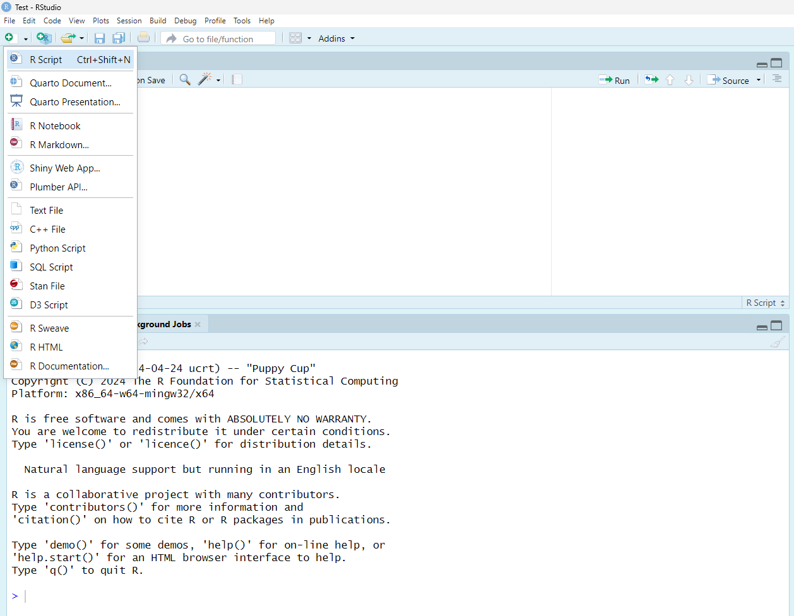

```{r setup, include=FALSE}
knitr::opts_chunk$set(echo = TRUE)
```

<a href="https://github.com/Smithsonian/IntroductionToDataMgmt.git" class="github-corner" aria-label="View source on GitHub"><svg width="80" height="80" viewBox="0 0 250 250" style="fill:#151513; color:#fff; position: absolute; top: 0; border: 0; right: 0;" aria-hidden="true"><path d="M0,0 L115,115 L130,115 L142,142 L250,250 L250,0 Z"></path><path d="M128.3,109.0 C113.8,99.7 119.0,89.6 119.0,89.6 C122.0,82.7 120.5,78.6 120.5,78.6 C119.2,72.0 123.4,76.3 123.4,76.3 C127.3,80.9 125.5,87.3 125.5,87.3 C122.9,97.6 130.6,101.9 134.4,103.2" fill="currentColor" style="transform-origin: 130px 106px;" class="octo-arm"></path><path d="M115.0,115.0 C114.9,115.1 118.7,116.5 119.8,115.4 L133.7,101.6 C136.9,99.2 139.9,98.4 142.2,98.6 C133.8,88.0 127.5,74.4 143.8,58.0 C148.5,53.4 154.0,51.2 159.7,51.0 C160.3,49.4 163.2,43.6 171.4,40.1 C171.4,40.1 176.1,42.5 178.8,56.2 C183.1,58.6 187.2,61.8 190.9,65.4 C194.5,69.0 197.7,73.2 200.1,77.6 C213.8,80.2 216.3,84.9 216.3,84.9 C212.7,93.1 206.9,96.0 205.4,96.6 C205.1,102.4 203.0,107.8 198.3,112.5 C181.9,128.9 168.3,122.5 157.7,114.1 C157.9,116.9 156.7,120.9 152.7,124.9 L141.0,136.5 C139.8,137.7 141.6,141.9 141.8,141.8 Z" fill="currentColor" class="octo-body"></path></svg></a><style>.github-corner:hover .octo-arm{animation:octocat-wave 560ms ease-in-out}@keyframes octocat-wave{0%,100%{transform:rotate(0)}20%,60%{transform:rotate(-25deg)}40%,80%{transform:rotate(10deg)}}@media (max-width:500px){.github-corner:hover .octo-arm{animation:none}.github-corner .octo-arm{animation:octocat-wave 560ms ease-in-out}}</style>

# Learning Objectives

* Further your understanding of R and the R Studio interface
* Learn the basics in data manipulation using the `dplyr` package
* Learn to use `help()` to look up function documentation
* Run code from a script

# Introduction to Data Management

Now that you've learned the basics of R programming, we'll take things a step further and start working on your skills related to data analysis.  You will likely be unfamiliar with some of the operations you need to execute in this exercise. Part of the goal with this exercise, however, is for you to become more familiar with the *help* commands in R and with the internet solutions that exist.  Our ultimate goal is to make you aware of the tools that are available so that you can become an effective problem solver, working independently on data analyses.

# Running Code in a Script

So far, we've run code in the Console.  This is fine for quick queries. For anything to be shareable, reproducible, and to reduce our own efforts in the long-term, we should run code via a script.  An R script is a just a simple text file.  R-Studio uses the script by copying R commands from text in the file and pastes them into the Console as if you were manually entering the commands yourself.  This greatly enhances our ability to build off what we have created in the past, learn from previous experience, and quickly re-run analyses when new data are received.  To create an R script:

1. From the "file" mean, select "New File"
2. Click "R Script from the list of options

R-Studio will open your R script automatically after creating it.  Notice that the scripting window appears above the Console in what's known as the **Source** pane.

3. Save the R script in your working directly in the `Scripts` folder.  Name this file `IntroDataMgmt.R`. 


<br>
At the top of your script, provide brief information that describes the content of your script.  The content is up to you, but should briefly identify who created the file, when the file was created, and what the script does.  This will help when you return to the file at a later date or if you decide to share the file with a colleague in the future.  Remember that anything after the `#` symbol is a comment.  Use this symbol to make your code more readable, similar to below.  

```{r, eval=F}
# ******************************************************************
# ******************************************************************

# Project: Introduction to Data Analysis in R
# Description: A script which details some basic commands on how to manipulate data
# Author: <Your Name>
# Date Initialized: <dd month yyyy>

# ******************************************************************
# ******************************************************************
```

## Running an R Script

Running code via an R script is different than running code in the Console.  To interpret and run the code you've written, R needs you to send the code from the script to the Console.  Some common ways to run your code include:

1. Highlight the line of code you want to run and use the shortcut `Ctrl` + `Enter` (Windows) or `command` + `return` (Mac).  
2. Highlight your code and physically click the `Run` button in the top right of the Source pane with your mouse.

## Clearing your Workspace

You'll find that your Environment (Workspace) in the upper right panel will quickly become full with user-defined objects.  It's generally good practice to work with a clean Workspace when starting a session.  I generally start all my scripts with the following command to make sure you are starting fresh, something we will do to help develop good programming practices and reduce clutter.

```{r, eval=F}
# Clean your workspace/remove all objects
rm(list=ls())

# You can also remove a specific dataset using the following command
#rm(dataset)
```

# Data Table Manipulation with `Dplyr`

The most basic R skill is to query and manipulate data tables. As a beginner programmer, it is imperative to familiarize yourself with how to manipulate data.  Reinforcing these skills is like expanding your vocabulary in the new language that you are learning and is a great way to improve your R proficiency. If you wish to become really good at R, but don't know where to start, start with data table manipulation! 

<div style="float:right">

</div>

The base R functions that come with the default R installation have the capacity for almost all the table manipulation needs (e.g., `split(), subset(), apply(), sapply(), lapply(), tapply(), aggregate()`). However, sometimes their syntax are less user-friendly and intuitive than some of the special packages built for table manipulation purposes. So, here we are introducing a few of the most useful table manipulation functions within `dplyr` package. 

Note that you will have to use `install.packages()` and `library()` function to download and activate the `dplyr` before using it. You only need to install the package once on your computer.  You will need, however, to 'activate' the package any time you want to use the functions that exist within the package. 

```{r, eval = T, message = F, warning = F}
#install.packages("dplyr")
library(dplyr)
```

## Reading/Importing Data

R has multiple functions for reading in table data.  Here we'll use the base function `read.csv()` to import a table named `panda_data.csv` that is located in your `Data` folder. Text files (`.txt`) can be imported using the function `read.delim()`.  See the help files for each function and search Google for information on other functions to read other data types.

View the first few rows of the data table using the function `head()` or click on the dataframe in the Environment/History panel.

```{r, eval = T, echo = T, warning=F, message=F}
# Read dataset
panda_data <- read.csv(file="Data/panda_data.csv")

# Look at the data
head(panda_data)
```

**Questions**: 

1. Can you change the number of rows that are displayed with the `head()` function?  
2. How would you print the first 3 rows?
3. How would you print rows 4 thru 6? 
4. What are the dimensions of the dataframe?  How many rows and columns are there?
5. Can you guess how you might look at the last few rows of the dataframe?

```{r, eval = F, echo = F, warning=F, message=F}
# Print the first 3 rows
head(panda_data, n = 3)

# Print rows 4 thru 6
panda_data[4:6,]

# Dataframe dimensions
dim(panda_data)
nrow(panda_data)
ncol(panda_data)

# Print the tail
tail(panda_data)
```

## Selecting Columns 

The function `select()` is a powerful tool for selecting columns of interest.  You must specify the dataset you want to query and then also provide an expression for selecting columns of interest (`select(.data, expression)`).  A few examples are provided below: 

```{r, warning = F, message = F}
# select column called panda_name
select(panda_data, panda_name) 

# select all columns in the data except panda_name
select(panda_data, -panda_name)

# select a range of columns, from age to sex
select(panda_data, age:sex)
```

Various selection helpers also exist, including:

* `starts_with`: Expression select multiple columns that start with the same text.   
* `ends_with()`: Expression to select columns that end with the same text.  
* `contains()`: Expression to select columns that contain the same text.  
* `matches()`: Expression to select columns that match a regular expression.  
* `one_of()`: Expression to select columns that are from a group of names. 

```{r, warning = F, message = F}
# select all columns that start with "genetic" in their column names
select(panda_data, starts_with("genetic")) 
```

**Questions**: 

1. Select all the columns that contain "value" in the column name.
2. Select or exclude two columns: `panda_name` and `age`.  

```{r, warning = F, message = F, eval = F, echo = F}
# Select all the columns that contain "value" in the column name.
select(panda_data, contains("value")) 

# Select or exclude two columns: `panda_name` and `age`. 
select(panda_data, c(panda_name, age)) 
select(panda_data, !c(panda_name, age))
```

## Filtering Data

`Filter()` is similar to `select()`, except that you are selecting specific rows that satisfy a requirement based on a column value.  This function is very similar to the base function `subset()`.  A few examples on how to use `filter()` are provided below: 

](dplyr_filter.png)

<br>

```{r, warning=F, message=F}
# Select rows where pandas are greater than or equal to 5 years of age
filter(panda_data, age >= 5)

# select rows that have age>5 OR weight_kg >100 
filter(panda_data, age > 5 | weight_kg > 100)

# select rows that have age>5 AND base column has CD has entry
filter(panda_data, age > 5 & base == "CD") 

# Select rows where the panda age is defined by a few values.  Note the use of the %in% function.
filter(panda_data, age %in% c(4,5,7))
```

**Questions**:

1: Select rows with `NA` in the genetic_value2 column.   
2: Select rows whose panda_name column are `bao_bao` or `bei_bei`.

```{r, warning = F, message = F, eval = F, echo = F}
# Select rows with `NA` in the genetic_value2 column. 
filter(panda_data, is.na(genetic_value2)) 

# Select rows whose panda_name column are `bao_bao` or `bei_bei`
filter(panda_data, panda_name == 'bao_bao' | panda_name == 'bei_bei') 
```

##  Using the Pipe Operator 

Piping (`%>%`) allows the user to combine the output from one function to the input of another.  Thus, instead of nesting functions (reading from the inside to the outside), piping reads functions from left to right (i.e., the way we normally read things). As a result, reading piped code can be more intuitive and can help avoid creating and saving a lot of intermediate variables that you don't need.

```{r, message=F, warning=F}
# Use a simple pipe to select the panda name and it's sex, and output the result.
# Create a new object named 'pipe_result'
pipe_result <- panda_data %>%
  select(panda_name, sex) %>%
  head()

# Output the result to the screen 
pipe_result
```

**Questions**: 

1. Use a pipe operator to select all columns containing "genetic" in their names, but only select rows that have a genetic_value1 >80 AND genetic_value2 <90.  Don't create a new object when you create the query (i.e., just print the result to your screen).
2. What do you think will happen if you filter based on a field that hasn't been selected?  For instance, select all columns containing "genetic", but select the rows where animals weigh > 90 kg.

```{r, message=F, warning=F, eval=F, echo=F}
# Select columns that contain genetic and then selection values based on these columns
panda_data %>% 
  select(contains("genetic")) %>% 
  filter(genetic_value1 > 80 & genetic_value2 < 90)

# Example of filtering a column that doesn't exist after selecting
# The field doesn't exist and will cause an error
# panda_data %>% 
#   select(contains("genetic")) %>% 
#   filter(weight_kg > 90)
```

## Mutate

One of the most useful functions in `dplyr` package is `mutate()`.  Mutate allows the user to create new column(s), populating the columns with values that you define or from information in columns that already exist.  You can also use `mutate()` to control which columns are retained in the new object that you create by setting the `.keep` argument.

](dplyr_mutate.png)

<br>

```{r, warning=F, message=F}
# Create a new column, based on values from other columns that exist
# By default, keep = all
new_col_ex1 <- panda_data %>%
  mutate(genetic_value_new = genetic_value1 - genetic_value2,
         .keep = "all")  
# Print
new_col_ex1

# You can create multiple columns at once.  Best to put each new column on a separate line.  This simply makes the code more readable.
new_col_ex2 <- panda_data %>%
	mutate(genetic_dif = genetic_value1 - genetic_value2, 
	       weight_g = weight_kg * 1000) 
# Print
new_col_ex2
```

**Question**:

1. Create a new column in `panda_data` called `zero` and give it a value of 0?

```{r, warning=F, message=F, eval=F, echo=F} 
# Create a new column called zero
panda_data %>%
  mutate(zero = 0)
```

## Arrange, Relocate, and Rename

It is common to receive data in ways that we want to change or alter.  For instance, we might want to change the order of the columns, re-order the rows based on particular column values, or we may want to change the column headings.  `Mutate()` includes options to change the order of columns that you create (see `.before` and `.after` in the `help` for the function).  `Relocate()` can be used move columns around using the `.before` and `.after` commands, `arrange()` can be used to order the rows, and `rename()` can be used to give new names to column headings.  By default, `arrange` will arrange the selecting column in ascending order.  We can use `desc()` to arrange the column in descending order.

](dplyr_relocate.png)

<br>

```{r}
# Arrange the panda_data by panda_name in descending order
# Place the sex column after the ID column
order_data_ex1 <- panda_data %>% 
	arrange(desc(panda_name)) %>% 
  relocate(sex, .after = ID)
# Print
head(order_data_ex1)

# Arrange the panda_data by genetic_value 1 and genetic_value2 after select the columns that start with 'genetic'
# Rename the genetic_value1 column to gen_val1
order_data_ex2 <- panda_data %>% 
	select(starts_with("genetic")) %>%
	arrange(genetic_value1, genetic_value2) %>% 
  rename(gen_val1 = genetic_value1)
# Print
head(order_data_ex2)
```

**Question**: 

1. Arrange the panda_data by age and then by panda weight, putting the year column before age and the base column after the last column?  Rename the weight column to `panda_wgt_kg`.

```{r, message=F, warning=F, echo=F, eval=F}
# Arrange the panda dataset by age and weight, relocating columns and renaming the weight column
panda_data %>% 
  arrange(age, weight_kg) %>% 
  relocate(year, .before = age) %>% 
  relocate(base, .after = last_col()) %>% 
  rename(panda_wgt_kg = weight_kg)
```

## Summarise

Summary statistics are easily calculated using the `summarise()` function (note: `summarize()` will also work).  The summary statistics will be calculated among all rows in the dataframe, unless specified otherwise.  `Summarize()` is often used in combination with `group_by()` (see below for more information).  Various useful summary functions are provided in the `help` documentation for the function.

```{r, message=F, warning=F}
# Calculate the mean weight of the pandas and provide a count.
sum_table <- panda_data %>% 
  summarise(mean_wgt = mean(weight_kg),
            n = n())
# Print summary table
sum_table

# Calculate the avg weight and minimum weight.  Don't create a new object.
panda_data %>% 
  summarise(avg_wt = mean(weight_kg), 
            min_wt = min(weight_kg))
```

## Grouping Functions

Grouping data together for class summaries has been improved in the latest version of `dplyr` by adding `.by` to the `summarise()` function.  As a result, it is no longer necessary to use the function `Group_by()` in addition and/or external to `summarise()`.  The `.by` argument allows you to group your columns of interest and generate a series of summary statistics.    

```{r, warning=F, message=F}
# Similar to above, calculate average and minimum weight, but summarize based on 'base' column.  Include a count of each group.
panda_data %>%
  summarise(avg_wt = mean(weight_kg),
            min_wt = min(weight_kg),
            n = n(),
            .by = base)

# Group summaries can also be calculated across muultiple groups.
# Here, we calculate the same as above, but based on base and sex
panda_data %>%
  summarise(avg_wt = mean(weight_kg),
            min_wt= min(weight_kg),
            n = n(), 
            .by = c(base, sex))
```

## Joining Tables

The last of the important tools we will cover in `dplyr` is how to join tables together.  This is common practice in ecological statistics, with data in one table that are required to be appended to another table for analyses.  To join these tables, we need to link the tables based on shared columns.  

As an example, we will import a table (`panda_data_med.csv`) located in our `Data` folder that summarizes the vaccination history of each our pandas.  Similar to other functions, we have multiple options to join the tables together.  The most common join to use is a `left_join()`.  In this case, all the records in our first table (i.e., the left table) are linked with those that match or are shared with the second data table (i.e., the right table).  The means that we will keep all the records in the left table and include only those records that match in the right table (they will be returned NA if no match exists).  

Other join options, including `inner_join()`, `right_join`, and `full_join()` also exist.  Read the `help` file to determine which join is most appropriate to accomplish the activity of interest.

**Note**: Sometimes the column headings between tables do not match, even if the data within the column does (`ID` in table 1 != `id` in table 2).  In these cases, you can either `rename()` the column headings to make them match or specify columns you want to join.

```{r, warning=F, message=F}
# Read in the vaccination table
panda_med <- read.csv(file="Data/panda_data_med.csv")

# Join all the rows in table 1 (panda_data) with table 2 (panda_med) to determine which of the pandas were vaccinated.  Since ID exists in both tables, this is a straightforward join.
# Arrange the result by ID and year vaccinated
panda_join_ex1 <- panda_data %>% 
  left_join(panda_med, by = "ID") %>% 
  arrange(ID, year_vaccination)
# Print
head(panda_join_ex1)

# Example of how to join based on multiple fields and fields that don't exactly match
panda_join_ex2 <- panda_data %>%
  left_join(panda_med,
            by = c("ID" = "ID", 
                   "year"= "year_vaccination")) 
# Print
head(panda_join_ex2)
```

# Exercise

Now that you've been exposed to a few functions to better manage data in R, we will reinforce these tools by asking you to apply them to memory by practicing on a dataset of wildlife counts collected across the Naboisho conservancy.  Located in your `Data` folder and named `SampleData.csv`, these data are derived from our publication in the African Journal of Ecology that forms the foundation for this project.

<div style="float:right">

</div>

Upon import you will note that the dataset is comprised of 5 columns:

* `Date`: The date the transect was conducted
* `Species`: Species name
* `GroupSize`: Total number of animals in the counted group
* `TransectID`: Name of each transect
* `Year`: Year in which the data were collected

Please create a script named `Exercise1_DataMgmt.R`.  Format the script like we have instructed to do so in this lecture with your `Name`, `Date`, and `Description`.  Then, read in the data and create a fully commented code to answer the following questions:   

1) What are the dimensions of the dataset?  How many rows and columns exist?
2) What is the data structure of each variable?
3) How many species were counted?
4) How many transects are there and what are the names of these transects?
5) How many unique survey days were completed?  What is the range of dates?

Please use a %>% for the followings questions (you don't need to save the output):

6) What is the maximum group size of giraffe?
7) What is the mean group size of wildebeest per year?  Include the number of observations in the calculation.
8) What is the total count of impala observed in 2018?
9) What is the total number of groups of each species per year?
10) What is the total number of groups and the mean group size of each species, per year, and per transect?  Sort these by Species, TransectID, and Year.

**Note**: We didn't go over every function to answer these questions.  You may need to troubleshoot and search the web to find the appropriate function.  Remember to use `R-Cran` when searching to limit/fine tune your search.  Using `dplyr` in your search term can also help in narrowing down your search.

The data used for this exercise can be referenced as:

Crego RD, Wells HBM, Connette G, Stabach JA, Soit N, Thompson S. 2023. Monitoring spatiotemporal dynamics of large herbivores across an African rangeland using hierarchical multi-species distance sampling. African Journal of Ecology. [doi:10.1111/aje.13219](https://onlinelibrary.wiley.com/doi/10.1111/aje.13219)

```{r, warning=T, message=T, echo=F, eval=F}
# Read in the CSV
survey_sample <- read.csv(file = "Data/SampleData.csv")

# Look at the data
head(survey_sample)

# Question 1: What are the dimensions of the dataset?  How many rows and columns?
dim(survey_sample)
nrow(survey_sample)
ncol(survey_sample)

# Question 2: What is the data structure of each variable?
str(survey_sample)

# Question 3: How many species were counted?  
length(unique(survey_sample$Species))
n_distinct(survey_sample$Species)

# Question 4: How many transects are there and what are the names of these transects?  Same process, but a different column.
n_distinct(survey_sample$TransectID)
unique(survey_sample$TransectID)

# Question 5: How many unique survey days were completed?  What is the range of dates?
length(unique(survey_sample$Date))
min(survey_sample$Date)
max(survey_sample$Date)

# Question 6: What is the maximum group size of giraffe?
survey_sample %>% 
  filter(Species == "Giraffe") %>% 
  summarise(max_grp = max(GroupSize))

# Question 7: What is the mean group size of wildebeest per year?  Include the number of observations in the calculation.
survey_sample %>% 
  filter(Species == "Wildebeest") %>% 
  summarise(mean_grp = mean(GroupSize),
            n_obs = n(), # This counts the observations, it is not a sum of the observations.
            .by=Date) 

# Question 8: What is the total count of impala observed in 2018?
survey_sample %>% 
  filter(Species == "Impala" & Year == "2018") %>%
  summarise(sum_impala = sum(GroupSize))
  
# Question 9: What is the total number of groups of each species per year?
survey_sample %>% 
  summarise(Total_Grps = n(),
            .by=c(Species, Year))
  
# Question 10: What is the total number of groups and the mean group size of each species, per year, and per transect?  Sort these by Species, TransectID, and Year
survey_sample %>% 
  summarise(Total_Grps = n(),
            Mean_Grps = mean(GroupSize),
            .by = c(Species, Year, TransectID)) %>% 
  arrange(Species, TransectID, Year)
```